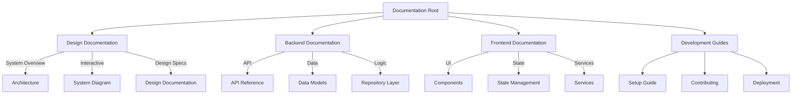

# Chess Database System Documentation

[← Back to Project Root](../README.md) | [System Architecture](design/system-diagram.md) | [API Reference](design/backend/api.md)

## Navigation
- [System Overview](#system-overview)
- [Design Documentation](#design-documentation)
- [Backend Documentation](#backend-documentation)
- [Frontend Documentation](#frontend-documentation)
- [Getting Started](#getting-started)
- [Development Guide](#development-guide)
- [Contributing](#contributing)
- [Support](#support)

Welcome to the Chess Database System documentation. This comprehensive guide covers all aspects of the system, from high-level architecture to detailed implementation specifics.

## Quick Links
- [System Architecture](design/system-diagram.md) - Interactive system overview
- [API Reference](design/backend/api.md) - API endpoints and usage
- [Frontend Components](design/frontend/components.md) - UI components and features
- [Database Models](design/backend/models.md) - Data structure and relationships

## Documentation Structure

### 1. System Overview
- [System Architecture](architecture.md)
  - High-level system design
  - Component interactions
  - Technology stack
  - Deployment architecture

### 2. Design Documentation
- [System Diagram](design/system-diagram.md)
  - Interactive component diagrams
  - Layer relationships
  - Data flow visualization
- [Design Overview](design/README.md)
  - Design principles
  - System requirements
  - Development practices

### 3. Backend Documentation
- [API Design](design/backend/api.md)
  - Endpoint specifications
  - Request/response formats
  - Authentication/authorization
  - Error handling
- [Repository Layer](design/backend/repository.md)
  - Domain repositories
  - Data access patterns
  - Business logic
  - Error handling
- [Data Models](design/backend/models.md)
  - Database schema
  - Model relationships
  - Validation rules
  - Migration management

### 4. Frontend Documentation
- [Component Design](design/frontend/components.md)
  - UI components
  - State management
  - Service integration
  - Error handling

## Getting Started

### Prerequisites
- Docker and Docker Compose
- Node.js 18+
- Python 3.9+
- PostgreSQL 13+

### Quick Start
1. Clone the repository
   ```bash
   git clone https://github.com/yourusername/chess-db.git
   cd chess-db
   ```

2. Set up environment
   ```bash
   cp .env.example .env
   cp .env.db.example .env.db
   ```

3. Start services
   ```bash
   docker-compose up -d
   ```

4. Access the application
   - Frontend: http://localhost:3000
   - API Docs: http://localhost:8000/docs
   - Admin: http://localhost:8000/admin

## Development Guide

### Backend Development
1. Install dependencies
   ```bash
   cd src/backend
   pip install -r requirements.txt
   ```

2. Run migrations
   ```bash
   alembic upgrade head
   ```

3. Start development server
   ```bash
   uvicorn main:app --reload
   ```

### Frontend Development
1. Install dependencies
   ```bash
   cd src/frontend
   npm install
   ```

2. Start development server
   ```bash
   npm run dev
   ```

## Contributing

### Development Workflow
1. Create feature branch
2. Implement changes
3. Write tests
4. Submit pull request

### Documentation Updates
1. Update relevant documentation files
2. Update system diagrams if needed
3. Verify documentation links
4. Update index if needed

## Support

### Getting Help
- Create an issue in the repository
- Check existing documentation
- Contact development team

### Troubleshooting
- Check logs in `src/backend/logs`
- Verify environment configuration
- Review common issues in documentation

## Documentation Map



## License
[MIT License](LICENSE)

## Acknowledgments
- Chess.js for chess logic
- FastAPI for backend framework
- React for frontend framework
- PostgreSQL for database
