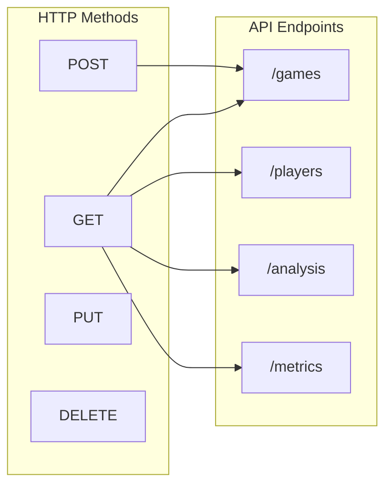
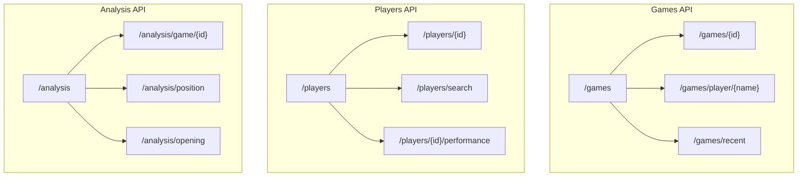
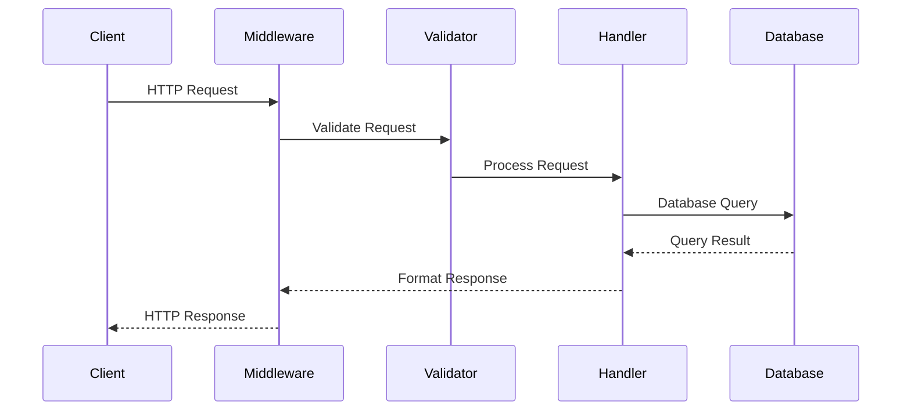
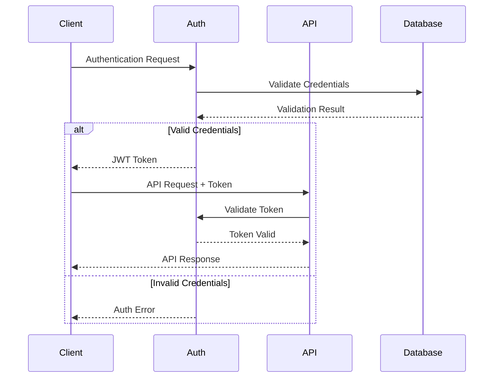
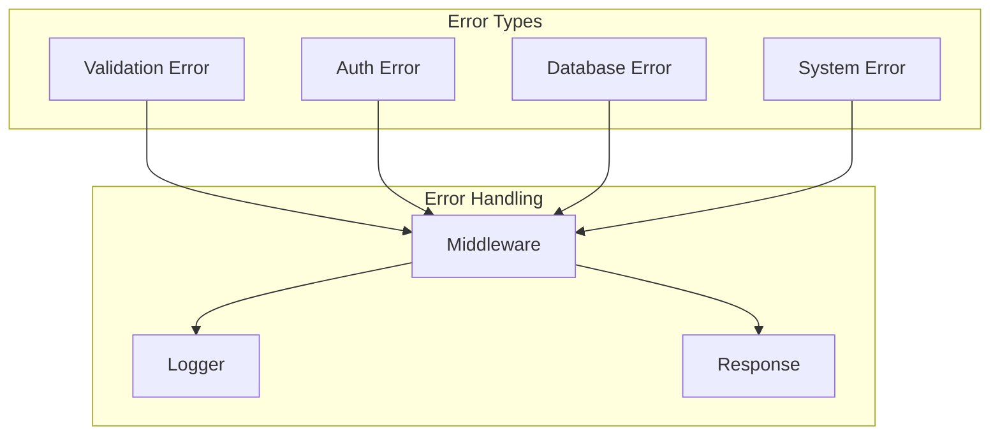
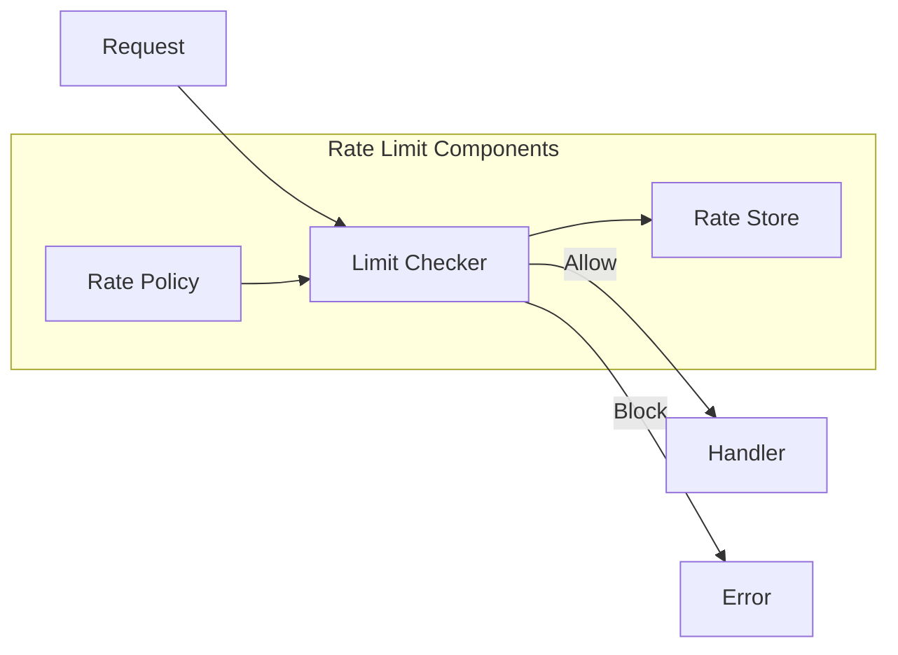

# API Reference



## Overview

The Chess Database API is built using FastAPI and provides endpoints for managing chess games, players, and analysis. The API is versioned and follows RESTful principles.

## Base URL

```
https://api.chess-database.org/v1
```

## Authentication

All API requests require authentication using an API key. Include the key in the request header:

```http
Authorization: Bearer YOUR_API_KEY
```

## Endpoints

### Games API (`/api/games`)

#### List Games
- `GET /api/games`
  - Query parameters:
    - `limit`: Maximum number of games to return
    - `offset`: Number of games to skip
    - `player`: Filter by player name
    - `date_from`: Filter games after date
    - `date_to`: Filter games before date

#### Get Game
- `GET /api/games/{game_id}`
  - Returns detailed game information including moves and analysis

#### Import Game
- `POST /api/games/import`
  - Body: PGN format chess game

### Players API (`/api/players`)

#### List Players
- `GET /api/players`
  - Query parameters:
    - `limit`: Maximum number of players to return
    - `offset`: Number of players to skip
    - `name`: Filter by player name

#### Get Player
- `GET /api/players/{player_id}`
  - Returns player statistics and game history

#### Search Players
- `GET /api/players/search`
  - Query parameters:
    - `query`: Search term
    - `limit`: Maximum results

### Analysis API (`/api/analysis`)

#### Analyze Position
- `POST /api/analysis/position`
  - Body: FEN position string
  - Returns position evaluation and suggested moves

#### Game Analysis
- `POST /api/analysis/game`
  - Body: Game ID or PGN
  - Returns full game analysis

### Database API (`/api/database`)

#### Database Stats
- `GET /api/database/stats`
  - Returns database statistics

#### Database Maintenance
- `POST /api/database/maintenance`
  - Performs database optimization tasks

## Endpoint Structure



## Request/Response Flow



## Authentication Flow



## Error Handling



## Rate Limiting



## Response Format

All API responses follow this format:

```json
{
  "status": "success|error",
  "data": {
    // Response data
  },
  "message": "Optional message"
}
```

## Error Handling

The API uses standard HTTP status codes:
- 200: Success
- 400: Bad Request
- 404: Not Found
- 500: Server Error

Error responses include detailed messages:

```json
{
  "status": "error",
  "message": "Detailed error message",
  "code": "ERROR_CODE"
}
```

## Rate Limiting

API requests are limited to ensure system stability. Current limits:
- 100 requests per minute per IP
- 1000 requests per hour per IP

## Metrics and Monitoring

The API includes middleware for:
- Performance monitoring
- Request metrics
- Error tracking

## API Versioning

The current API version is specified in the configuration. Version information is included in the API path when needed.

## Endpoint Details

### Games API

```mermaid
classDiagram
    class GameEndpoint {
        +GET /games
        +GET /games/{id}
        +GET /games/player/{name}
        +POST /games
        +PUT /games/{id}
        +DELETE /games/{id}
    }
    
    class GameResponse {
        +id: int
        +white_player: Player
        +black_player: Player
        +result: string
        +moves: string
        +date: date
    }
    
    GameEndpoint -- GameResponse
```

### Players API

```mermaid
classDiagram
    class PlayerEndpoint {
        +GET /players
        +GET /players/{id}
        +GET /players/search
        +GET /players/{id}/performance
    }
    
    class PlayerResponse {
        +id: int
        +name: string
        +rating: int
        +games: Game[]
        +statistics: Stats
    }
    
    PlayerEndpoint -- PlayerResponse
```

### Analysis API

```mermaid
classDiagram
    class AnalysisEndpoint {
        +GET /analysis/game/{id}
        +GET /analysis/position
        +GET /analysis/opening
    }
    
    class AnalysisResponse {
        +score: float
        +best_move: string
        +variation: string[]
        +statistics: Stats
    }
    
    AnalysisEndpoint -- AnalysisResponse
```
