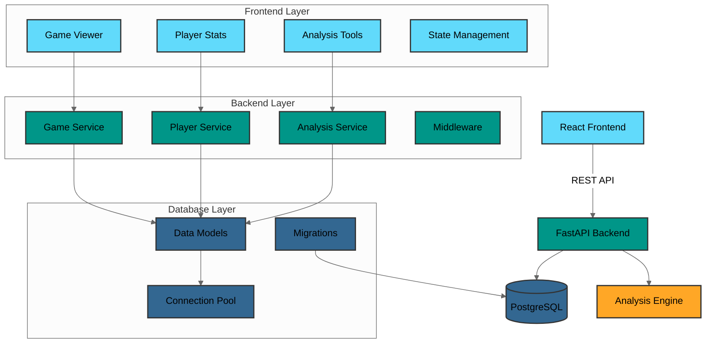
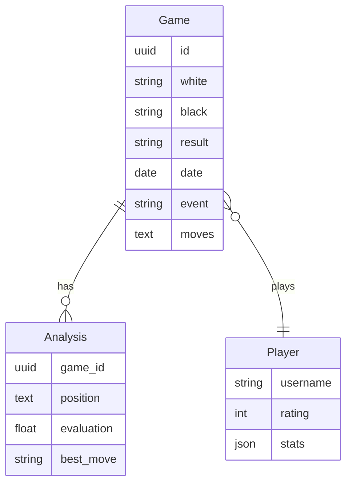
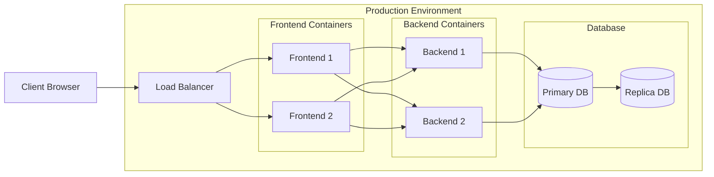

# System Architecture

The Chess Database implements a modern, microservices-based architecture comprising three primary layers: frontend, backend API, and database. Each layer is containerized using Docker for consistent deployment and scalability.

## System Overview



## Frontend Layer

The frontend is implemented as a Single Page Application (SPA) using React with TypeScript, providing type safety and improved developer experience.

### Key Components

- **Game Viewer**: Interactive chess board with move navigation
- **Analysis Tools**: Real-time position evaluation and move suggestions
- **Player Statistics**: Performance tracking and visualization
- **Opening Explorer**: Opening theory and statistics

### Technical Stack

- React 18+ with TypeScript
- Vite for build optimization
- Tailwind CSS for styling
- React Context for state management
- Jest and React Testing Library for testing

## Backend API Layer

The backend is built on FastAPI, a modern Python web framework optimized for high performance and asynchronous operations.

### Key Features

- RESTful API endpoints with OpenAPI documentation
- Asynchronous request handling using asyncio
- Comprehensive middleware stack:
  - Performance monitoring
  - Request logging
  - Error handling
  - Rate limiting
  - CORS protection

### API Structure

```
/api/v1
├── /games
│   ├── GET /
│   ├── GET /{id}
│   ├── POST /
│   └── DELETE /{id}
├── /players
│   ├── GET /
│   ├── GET /{username}
│   └── GET /{username}/stats
└── /analysis
    ├── POST /position
    └── POST /game/{id}
```

## Database Layer

PostgreSQL serves as the primary database, chosen for its robust support for complex queries and scalability.

### Key Features

- Asynchronous connection pooling via asyncpg
- SQLAlchemy ORM for type-safe database interactions
- Alembic for database migration management
- Automated connection recycling
- Query optimization through indexes

### Data Models



## Security Measures

The system implements several security features:

- CORS protection with configurable origins
- Rate limiting on API endpoints
- SQL injection prevention
- Secure environment variable management
- Input validation and sanitization

## Performance Optimization

Performance is optimized through:

- Asynchronous database operations
- Connection pooling
- Response caching
- Query optimization
- Frontend bundle optimization
- CDN integration for static assets

## Deployment Architecture

The system is containerized using Docker and can be deployed using Docker Compose or Kubernetes:



## Monitoring and Logging

The system includes comprehensive monitoring and logging:

- Prometheus metrics collection
- Grafana dashboards
- Structured logging with correlation IDs
- Error tracking and alerting
- Performance monitoring
- Health check endpoints
