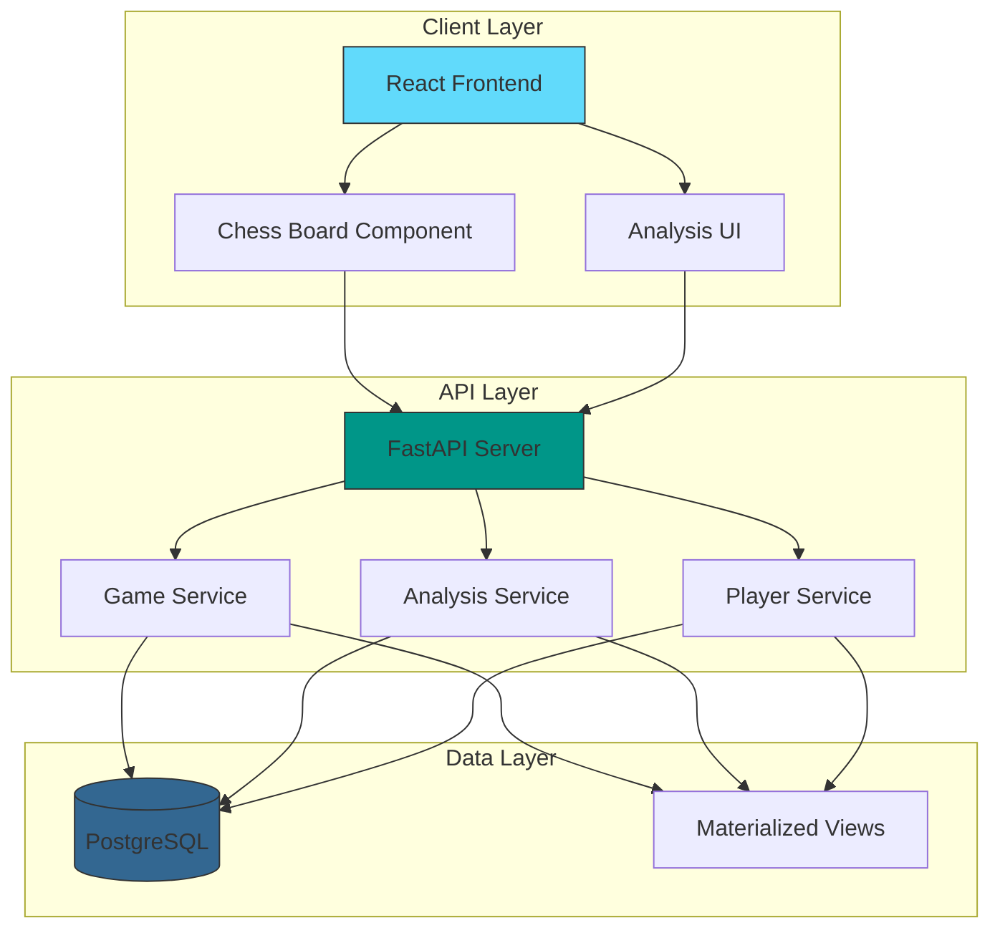
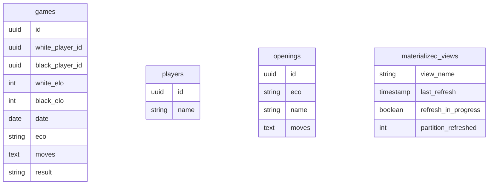
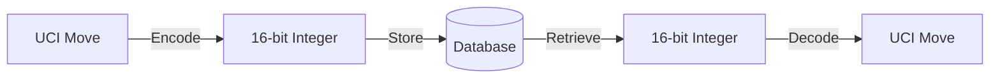

# System Architecture

[← Documentation Home](README.md) | [System Diagram](system-diagram.md) | [API Reference](api-reference.md) | [Optimizations](optimizations.md)

<script type="module">
	import mermaid from 'https://cdn.jsdelivr.net/npm/mermaid@10/dist/mermaid.esm.min.mjs';
	mermaid.initialize({
		startOnLoad: true,
		theme: 'light'
	});
</script>

## Overview

The Chess Database implements a modern, microservices-based architecture comprising three primary layers: frontend, backend API, and database. Each layer is containerized using Docker for consistent deployment and scalability.

## Related Documentation

- [Interactive System Diagram](system-diagram.md)
- [Frontend Components](frontend/components.md)
- [Backend Services](backend/api.md)
- [Data Models](backend/models.md)
- [Repository Layer](backend/repository.md)
- [Deployment Guide](deployment.md)

## System Overview

<div class="mermaid-wrapper">
<pre class="mermaid">
%%{init: {'theme': 'neutral' }}%%
graph TB
    %% Main Components
    Frontend[React Frontend]
    Backend[FastAPI Backend]
    DB[(PostgreSQL)]
    Analysis[Analysis Engine]

    %% Frontend Components
    subgraph "Frontend Layer"
        GameViewer[Game Viewer]
        AnalysisTools[Analysis Tools]
        PlayerStats[Player Stats]
        StateManagement[State Management]
    end

    %% Backend Services
    subgraph "Backend Layer"
        GameService[Game Service]
        PlayerService[Player Service]
        AnalysisService[Analysis Service]
        Middleware[Middleware]
    end

    %% Database Layer
    subgraph "Database Layer"
        Models[Data Models]
        Migrations[Migrations]
        ConnectionPool[Connection Pool]
    end

    %% Connections
    Frontend --> |REST API| Backend
    Backend --> DB
    Backend --> Analysis
    
    %% Layer Connections
    GameViewer --> GameService
    AnalysisTools --> AnalysisService
    PlayerStats --> PlayerService
    
    GameService --> Models
    PlayerService --> Models
    AnalysisService --> Models
    
    Models --> ConnectionPool
    Migrations --> DB

    %% Styling
    classDef frontend fill:#61DAFB,stroke:#333,stroke-width:2px
    classDef backend fill:#009688,stroke:#333,stroke-width:2px
    classDef database fill:#336791,stroke:#333,stroke-width:2px
    classDef analysis fill:#FFA726,stroke:#333,stroke-width:2px
    
    class Frontend,GameViewer,AnalysisTools,PlayerStats,StateManagement frontend
    class Backend,GameService,PlayerService,AnalysisService,Middleware backend
    class DB,Models,Migrations,ConnectionPool database
    class Analysis analysis
</pre>
</div>

## High-Level Architecture



## Core Components

### Frontend Layer
{: .text-delta }

1. **React Application**
   - Built with Vite for fast development
   - Uses Tailwind CSS for styling
   - Implements responsive design

2. **Chess Components**
   - Interactive chess board
   - Move validation
   - PGN viewer

3. **Analysis Interface**
   - Position evaluation
   - Opening explorer
   - Game statistics

### API Layer
{: .text-delta }

1. **FastAPI Server**
   - RESTful API endpoints
   - WebSocket support
   - Authentication middleware

2. **Service Layer**
   - Game management
   - Player statistics
   - Position analysis

3. **Middleware**
   - Performance monitoring
   - Error handling
   - Rate limiting

### Data Layer
{: .text-delta }

1. **PostgreSQL Database**
   - Core Tables:
     - games (id, white_player_id, black_player_id, white_elo, black_elo, date, eco, moves, result)
     - players (id, name)
     - openings (id, eco, name, moves)
     - schema_migrations (version, applied_at)

2. **Materialized Views**
   - materialized_view_refresh_status (view_name, last_refresh, refresh_in_progress, partition_refreshed)
   - game_opening_matches (game_id, opening_id, game_move_length, opening_move_length, partition_num)
   - move_count_stats (actual_full_moves, number_of_games, avg_bytes, partition_distribution)
   - endpoint_performance_stats (endpoint, method, total_calls, successful_calls, error_count, response metrics)
   - player_opening_stats (player statistics by opening)
   - games_with_result_str (denormalized game data with string results)

## Design Principles

{: .important }
The system follows these key principles:

1. **Separation of Concerns**
   - Clear boundaries between layers
   - Modular component design
   - Independent scaling

2. **RESTful Architecture**
   - Stateless communication
   - Resource-based URLs
   - Standard HTTP methods

3. **Performance First**
   - Materialized views for fast reads
   - Optimized queries
   - Efficient data partitioning

## Scalability

The system is designed to scale horizontally:

{: .note }
- Frontend can be served through CDN
- API servers can be load balanced
- Database supports partitioning and replication

## Database Schema



## Performance Monitoring

The system includes comprehensive monitoring through materialized views:

1. **Endpoint Metrics**
   - Request latency
   - Success/error rates
   - Response sizes
   - Call volumes

2. **Game Statistics**
   - Move counts
   - Storage metrics
   - Opening frequencies
   - Player activity

3. **System Health**
   - View refresh status
   - Partition statistics
   - Database performance

## Next Steps

- [Setup Development Environment](guides/setup)
- [API Documentation](api-reference)
- [Component Details](frontend/components)

## Frontend Layer

The frontend is implemented as a Single Page Application (SPA) using React with TypeScript, providing type safety and improved developer experience.

### Key Components

- **Game Viewer**: Interactive chess board with move navigation
- **Analysis Tools**: Real-time position evaluation and move suggestions
- **Player Statistics**: Performance tracking and visualization
- **Opening Explorer**: Opening theory and statistics

### Technical Stack

- React 18+ with TypeScript
- Vite for build optimization
- Tailwind CSS for styling
- React Context for state management
- Jest and React Testing Library for testing

## Backend API Layer

The backend is built on FastAPI, a modern Python web framework optimized for high performance and asynchronous operations.

### Key Features

- RESTful API endpoints with OpenAPI documentation
- Asynchronous request handling using asyncio
- Comprehensive middleware stack:
  - Performance monitoring
  - Request logging
  - Error handling
  - Rate limiting
  - CORS protection

### API Structure

```
/api/v1
├── /games
│   ├── GET /
│   ├── GET /{id}
│   ├── POST /
│   └── DELETE /{id}
├── /players
│   ├── GET /
│   ├── GET /{username}
│   └── GET /{username}/stats
└── /analysis
    ├── POST /position
    └── POST /game/{id}
```

## Infrastructure Implementation

<div class="mermaid-wrapper">
<pre class="mermaid">
graph TB
    %% Container Components
    subgraph Containers["Docker Environment"]
        direction LR
        NGINX["NGINX Proxy"]
        APP["Application"]
        REDIS["Redis Cache"]
        POSTGRES["PostgreSQL"]
    end
    
    %% External Components
    CLIENT(("Client"))
    MONITORING["Monitoring"]
    BACKUP["Backup Service"]
    
    %% Flow Relationships
    CLIENT --> NGINX
    NGINX --> APP
    APP --> REDIS
    APP --> POSTGRES
    
    MONITORING --> APP
    MONITORING --> REDIS
    MONITORING --> POSTGRES
    
    POSTGRES --> BACKUP
    
    %% Styling
    classDef container fill:#e3f2fd,stroke:#1565c0,stroke-width:2px;
    classDef service fill:#e8f5e9,stroke:#2e7d32,stroke-width:2px;
    classDef external fill:#fff3e0,stroke:#e65100,stroke-width:2px;
    
    class NGINX,APP,REDIS,POSTGRES container;
    class MONITORING,BACKUP service;
    class CLIENT external;
    
    %% Container Styling
    style Containers fill:#f5f5f5,stroke:#212121,stroke-width:2px;
</pre>
</div>

## Data Flow Architecture

<div class="mermaid-wrapper">
<pre class="mermaid">
sequenceDiagram
    %% Participants
    participant C as Client
    participant UI as Frontend
    participant API as API Gateway
    participant Cache as Redis
    participant DB as PostgreSQL
    
    %% Request Flow
    C->>+UI: User Action
    UI->>+API: API Request
    
    %% Cache Check
    API->>+Cache: Check Cache
    alt Cache Hit
        Cache-->>-API: Return Cached Data
        API-->>UI: Response
        UI-->>C: Update View
    else Cache Miss
        Cache-->>API: Cache Miss
        API->>+DB: Query Data
        DB-->>-API: Data Response
        API->>Cache: Update Cache
        API-->>-UI: Response
        UI-->>-C: Update View
    end
    
    %% Styling
    note over C,UI: Client Layer
    note over API: Application Layer
    note over Cache,DB: Data Layer
</pre>
</div>

## Database Layer

PostgreSQL serves as the primary database, chosen for its robust support for complex queries and scalability.

### Key Features

- Asynchronous connection pooling via asyncpg
- SQLAlchemy ORM for type-safe database interactions
- Alembic for database migration management
- Automated connection recycling
- Query optimization through indexes

### Data Models

<div class="mermaid-wrapper">
<pre class="mermaid">
erDiagram
    Game {
        uuid id
        string white
        string black
        string result
        date date
        string event
        text moves
    }
    Player {
        string username
        int rating
        json stats
    }
    Analysis {
        uuid game_id
        text position
        float evaluation
        string best_move
    }
    Game ||--o{ Analysis : has
    Game }o--|| Player : plays
</pre>
</div>

## Database Implementation

<div class="mermaid-wrapper">
<pre class="mermaid">
graph TB
    %% Core Components
    subgraph Models["Data Models"]
        direction LR
        ORM["SQLAlchemy ORM"]
        SCHEMA["Schema Definitions"]
        VALID["Validators"]
    end
    
    subgraph Access["Data Access"]
        REPO["Repository Layer"]
        QUERY["Query Builder"]
        POOL["Connection Pool"]
    end
    
    subgraph Storage["Storage Layer"]
        PG["PostgreSQL"]
        CACHE["Redis Cache"]
        MV["Materialized Views"]
    end
    
    %% Relationships
    ORM --> REPO
    SCHEMA --> VALID
    VALID --> REPO
    
    REPO --> QUERY
    QUERY --> POOL
    POOL --> PG
    
    PG --> MV
    MV --> CACHE
    
    %% Styling
    classDef model fill:#e3f2fd,stroke:#1565c0,stroke-width:2px;
    classDef access fill:#f3e5f5,stroke:#4a148c,stroke-width:2px;
    classDef storage fill:#e8f5e9,stroke:#2e7d32,stroke-width:2px;
    
    class ORM,SCHEMA,VALID model;
    class REPO,QUERY,POOL access;
    class PG,CACHE,MV storage;
    
    %% Group Styling
    style Models fill:#f5f5f5,stroke:#333,stroke-width:2px;
    style Access fill:#f5f5f5,stroke:#333,stroke-width:2px;
    style Storage fill:#f5f5f5,stroke:#333,stroke-width:2px;
</pre>
</div>

## Service Layer Implementation

<div class="mermaid-wrapper">
<pre class="mermaid">
graph LR
    %% Service Components
    subgraph Services["Service Layer"]
        direction TB
        GS["Game Service"]
        PS["Player Service"]
        AS["Analysis Service"]
        MS["Metrics Service"]
    end
    
    subgraph Base["Base Components"]
        direction TB
        HTTP["HTTP Client"]
        CACHE["Cache Manager"]
        ERROR["Error Handler"]
        AUTH["Auth Manager"]
    end
    
    subgraph Core["Core Features"]
        direction TB
        VALID["Validation"]
        TRANS["Transformation"]
        LOG["Logging"]
        METRIC["Metrics"]
    end
    
    %% Relationships
    GS & PS & AS & MS --> HTTP
    HTTP --> CACHE
    HTTP --> ERROR
    HTTP --> AUTH
    
    ERROR --> LOG
    AUTH --> VALID
    VALID --> TRANS
    TRANS --> METRIC
    
    %% Styling
    classDef service fill:#e3f2fd,stroke:#1565c0,stroke-width:2px;
    classDef base fill:#f3e5f5,stroke:#4a148c,stroke-width:2px;
    classDef core fill:#e8f5e9,stroke:#2e7d32,stroke-width:2px;
    
    class GS,PS,AS,MS service;
    class HTTP,CACHE,ERROR,AUTH base;
    class VALID,TRANS,LOG,METRIC core;
    
    %% Group Styling
    style Services fill:#f5f5f5,stroke:#333,stroke-width:2px;
    style Base fill:#f5f5f5,stroke:#333,stroke-width:2px;
    style Core fill:#f5f5f5,stroke:#333,stroke-width:2px;
</pre>
</div>

## Security Implementation

<div class="mermaid-wrapper">
<pre class="mermaid">
graph TB
    %% Security Layers
    subgraph Auth["Authentication"]
        JWT["JWT Handler"]
        SESSION["Session Manager"]
        OAUTH["OAuth Provider"]
    end
    
    subgraph Protection["Protection Layer"]
        CORS["CORS Guard"]
        CSRF["CSRF Protection"]
        RATE["Rate Limiter"]
        XSS["XSS Prevention"]
    end
    
    subgraph Data["Data Security"]
        ENCRYPT["Encryption"]
        AUDIT["Audit Log"]
        BACKUP["Backup System"]
    end
    
    %% Request Flow
    REQUEST(("Request")) --> JWT
    JWT --> SESSION
    SESSION --> OAUTH
    
    OAUTH --> CORS
    CORS --> CSRF
    CSRF --> RATE
    RATE --> XSS
    
    XSS --> ENCRYPT
    ENCRYPT --> AUDIT
    AUDIT --> BACKUP
    
    %% Styling
    classDef auth fill:#e3f2fd,stroke:#1565c0,stroke-width:2px;
    classDef protect fill:#f3e5f5,stroke:#4a148c,stroke-width:2px;
    classDef data fill:#e8f5e9,stroke:#2e7d32,stroke-width:2px;
    classDef request fill:#fff3e0,stroke:#e65100,stroke-width:2px;
    
    class JWT,SESSION,OAUTH auth;
    class CORS,CSRF,RATE,XSS protect;
    class ENCRYPT,AUDIT,BACKUP data;
    class REQUEST request;
    
    %% Group Styling
    style Auth fill:#f5f5f5,stroke:#333,stroke-width:2px;
    style Protection fill:#f5f5f5,stroke:#333,stroke-width:2px;
    style Data fill:#f5f5f5,stroke:#333,stroke-width:2px;
</pre>
</div>

## Monitoring Implementation

<div class="mermaid-wrapper">
<pre class="mermaid">
graph TB
    %% Monitoring Components
    subgraph Metrics["Metrics Collection"]
        PERF["Performance"]
        ERROR["Error Tracking"]
        USAGE["Resource Usage"]
        LATENCY["Latency"]
    end
    
    subgraph Analysis["Analysis"]
        TREND["Trend Analysis"]
        ALERT["Alert System"]
        REPORT["Reporting"]
    end
    
    subgraph Visualization["Dashboards"]
        REAL["Real-time View"]
        HIST["Historical Data"]
        HEALTH["Health Status"]
    end
    
    %% Data Flow
    PERF & ERROR & USAGE & LATENCY --> TREND
    TREND --> ALERT
    TREND --> REPORT
    
    ALERT --> REAL
    REPORT --> HIST
    ALERT & REPORT --> HEALTH
    
    %% Styling
    classDef collect fill:#e3f2fd,stroke:#1565c0,stroke-width:2px;
    classDef analyze fill:#f3e5f5,stroke:#4a148c,stroke-width:2px;
    classDef visual fill:#e8f5e9,stroke:#2e7d32,stroke-width:2px;
    
    class PERF,ERROR,USAGE,LATENCY collect;
    class TREND,ALERT,REPORT analyze;
    class REAL,HIST,HEALTH visual;
    
    %% Group Styling
    style Metrics fill:#f5f5f5,stroke:#333,stroke-width:2px;
    style Analysis fill:#f5f5f5,stroke:#333,stroke-width:2px;
    style Visualization fill:#f5f5f5,stroke:#333,stroke-width:2px;
</pre>
</div>

## Data Storage Optimizations

### Move Encoding
The system uses a [custom binary encoding](backend/encoding.md) for chess moves that:
- Compresses moves to 2 bytes each
- Maintains fast access and processing
- Reduces storage requirements by ~60-70%



The encoding system is critical for:
- Efficient database storage
- Fast move processing
- Reduced network bandwidth
- Quick position analysis

## Security Measures

The system implements several security features:

- CORS protection with configurable origins
- Rate limiting on API endpoints
- SQL injection prevention
- Secure environment variable management
- Input validation and sanitization

## Performance Optimization

Performance is optimized through:

- Asynchronous database operations
- Connection pooling
- Response caching
- Query optimization
- Frontend bundle optimization
- CDN integration for static assets

## Deployment Architecture

The system is containerized using Docker and can be deployed using Docker Compose or Kubernetes:

<div class="mermaid-wrapper">
<pre class="mermaid">
graph LR
    Client[Client Browser]
    
    subgraph "Production Environment"
        LB[Load Balancer]
        subgraph "Frontend Containers"
            F1[Frontend 1]
            F2[Frontend 2]
        end
        subgraph "Backend Containers"
            B1[Backend 1]
            B2[Backend 2]
        end
        subgraph "Database"
            Master[(Primary DB)]
            Slave[(Replica DB)]
        end
    end
    
    Client --> LB
    LB --> F1
    LB --> F2
    F1 --> B1
    F1 --> B2
    F2 --> B1
    F2 --> B2
    B1 --> Master
    B2 --> Master
    Master --> Slave
</pre>
</div>

## Monitoring and Logging

The system includes comprehensive monitoring and logging:

- Prometheus metrics collection
- Grafana dashboards
- Structured logging with correlation IDs
- Error tracking and alerting
- Performance monitoring
- Health check endpoints
