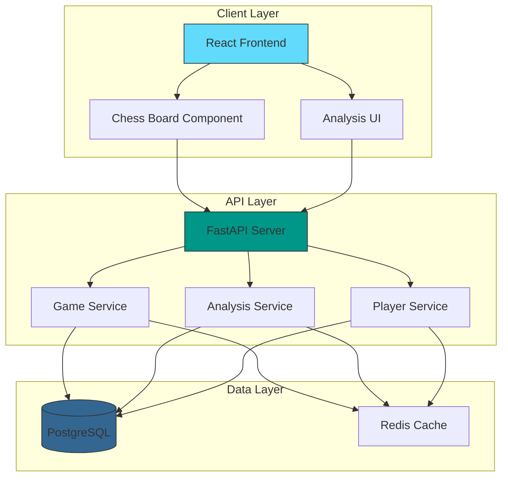

# System Architecture

{: .fs-9 }
A comprehensive overview of the Chess Database system architecture.

{: .fs-6 .fw-300 }
The Chess Database is built using a modern, scalable architecture that separates concerns between frontend, backend, and database layers.

[View Components](frontend/components){: .btn .btn-primary .fs-5 .mb-4 .mb-md-0 .mr-2 }
[View API](api-reference){: .btn .fs-5 .mb-4 .mb-md-0 }

---

## High-Level Architecture

## Core Components

### Frontend Layer
{: .text-delta }

1. **React Application**
   - Built with Vite for fast development
   - Uses Tailwind CSS for styling
   - Implements responsive design

2. **Chess Components**
   - Interactive chess board
   - Move validation
   - PGN viewer

3. **Analysis Interface**
   - Real-time position evaluation
   - Opening explorer
   - Game statistics

### API Layer
{: .text-delta }

1. **FastAPI Server**
   - RESTful API endpoints
   - WebSocket support
   - Authentication middleware

2. **Service Layer**
   - Game management
   - Player statistics
   - Position analysis

3. **Middleware**
   - Performance monitoring
   - Error handling
   - Rate limiting

### Data Layer
{: .text-delta }

1. **PostgreSQL Database**
   - Game records
   - Player profiles
   - Analysis results

2. **Redis Cache**
   - Position cache
   - Session management
   - Rate limiting

## Design Principles

{: .important }
The system follows these key principles:

1. **Separation of Concerns**
   - Clear boundaries between layers
   - Modular component design
   - Independent scaling

2. **RESTful Architecture**
   - Stateless communication
   - Resource-based URLs
   - Standard HTTP methods

3. **Performance First**
   - Efficient caching
   - Optimized queries
   - Lazy loading

## Scalability

The system is designed to scale horizontally:

{: .note }
- Frontend can be served through CDN
- API servers can be load balanced
- Database supports replication

## Security

{: .warning }
Security measures include:

- CORS configuration
- Rate limiting
- Input validation
- SQL injection prevention

## Monitoring

The system includes comprehensive monitoring:

1. **Performance Metrics**
   - Request latency
   - Database performance
   - Cache hit rates

2. **Error Tracking**
   - Application errors
   - API failures
   - Database issues

3. **Usage Statistics**
   - Active users
   - API usage
   - Resource utilization

## Next Steps

- [Setup Development Environment](guides/setup)
- [API Documentation](api-reference)
- [Component Details](frontend/components)
