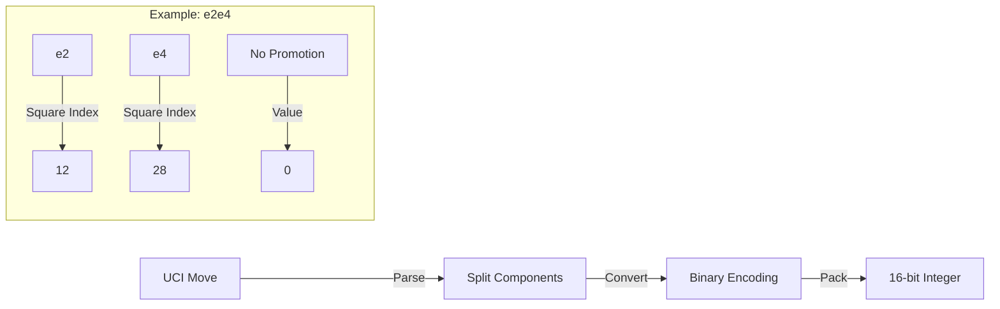

# Chess Move Encoding

{: .fs-9 }
Efficient binary encoding for chess moves storage.

{: .fs-6 .fw-300 }
The Chess Database uses a compact binary format to efficiently store chess moves, reducing storage requirements while maintaining fast access.

---

## Overview

The move encoding system converts UCI (Universal Chess Interface) moves into a compact 16-bit binary format, significantly reducing storage requirements while maintaining all essential move information.

## Move Format

Each chess move is encoded into a 16-bit integer using the following bit layout:

```
|<-- From Square (6 bits) -->|<-- To Square (6 bits) -->|<-- Promotion (4 bits) -->|
15                         10 9                        4 3                         0
```

### Components

1. **From Square (6 bits)**
   - Represents the starting square (0-63)
   - Maps to standard chess squares (a1=0 to h8=63)

2. **To Square (6 bits)**
   - Represents the destination square (0-63)
   - Uses same mapping as from square

3. **Promotion Piece (4 bits)**
   - 0: No promotion
   - 1: Pawn
   - 2: Knight
   - 3: Bishop
   - 4: Rook
   - 5: Queen
   - 6: King

## Encoding Process



### Example Encoding

For the move "e2e4":
1. From square "e2" = 12 (001100 in binary)
2. To square "e4" = 28 (011100 in binary)
3. No promotion = 0 (0000 in binary)
4. Final encoding: `0011000111000000` = 14,784

## Move List Storage

Multiple moves are stored in a binary format with the following structure:

```
|<-- Move Count (16 bits) -->|<-- Move 1 (16 bits) -->|<-- Move 2 (16 bits) -->|...
```

### Format Details

1. **Header**
   - First 16 bits store the total number of moves
   - Supports up to 65,535 moves per game

2. **Move Sequence**
   - Each move uses 16 bits
   - Moves are stored sequentially
   - No padding between moves

## Performance Optimizations

1. **Move Caching**
   ```python
   self._move_cache: Dict[str, int] = {}
   self._reverse_cache: Dict[int, str] = {}
   ```
   - Frequently used moves are cached
   - Bidirectional caching for fast encoding/decoding

2. **Bit Packing**
   - Uses Python's `struct` module for efficient binary packing
   - Employs `bitarray` for bit-level operations

3. **Error Handling**
   - Validates move format
   - Checks square indices
   - Verifies promotion pieces

## Storage Benefits

1. **Space Efficiency**
   - Standard PGN: ~5-7 bytes per move
   - Encoded format: 2 bytes per move
   - ~60-70% reduction in storage requirements

2. **Fast Processing**
   - Direct binary operations
   - No string parsing needed
   - Cached lookups for common moves

## Usage Example

```python
encoder = ChessMoveEncoder()

# Encoding moves
moves = ["e2e4", "e7e5", "g1f3"]
encoded = encoder.encode_moves(moves)

# Decoding moves
decoded = encoder.decode_moves(encoded)
assert decoded == moves
```

## Implementation Details

The encoding system is implemented in the `ChessMoveEncoder` class with these key methods:

1. **encode_moves(moves: List[str]) -> bytes**
   - Converts a list of UCI moves to binary format
   - Returns compressed bytes object

2. **decode_moves(encoded_data: bytes) -> List[str]**
   - Converts binary data back to UCI moves
   - Validates data integrity

3. **_encode_single_move(uci_move: str) -> int**
   - Converts one UCI move to 16-bit integer
   - Handles move validation and caching

4. **_decode_single_move(encoded_move: int) -> str**
   - Converts 16-bit integer back to UCI move
   - Includes cache lookup and validation
