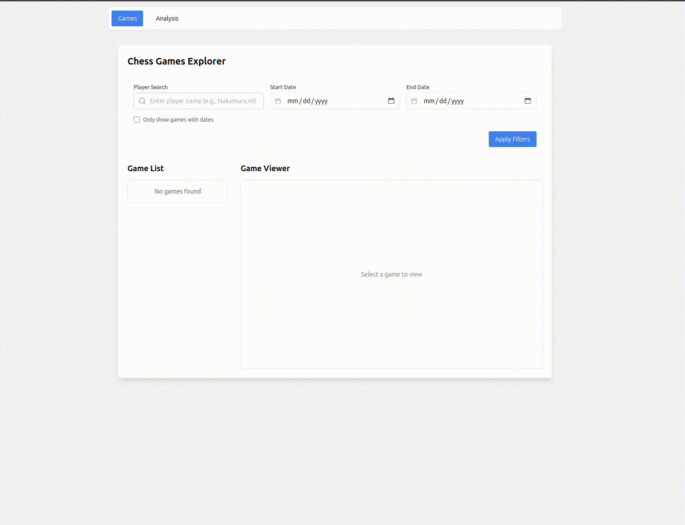
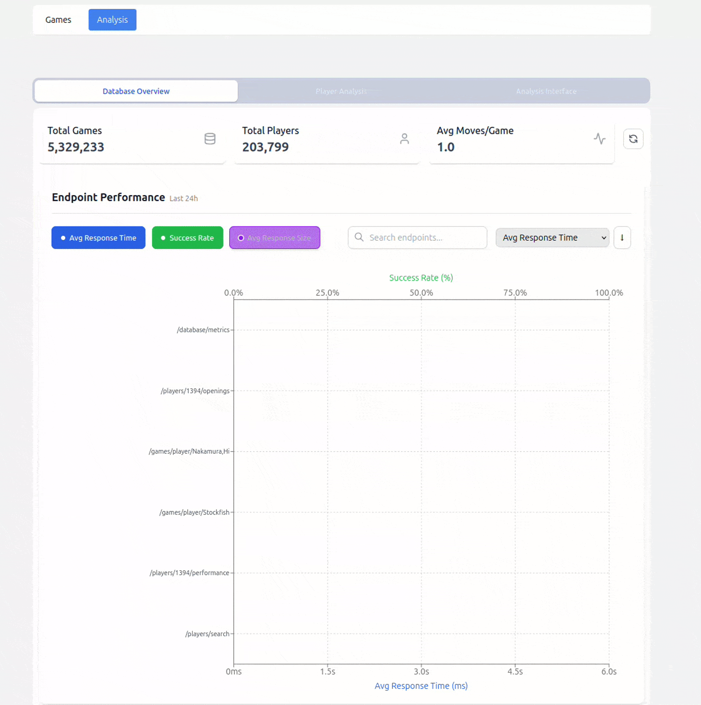

# Feature Demonstrations

{: .fs-9 }
Visual guides showing key features of the Chess Database system in action.

{: .fs-6 .fw-300 }
This page contains animated demonstrations of the main features and workflows.

[Try It Now](https://chess-database.org){: .btn .btn-primary .fs-5 .mb-4 .mb-md-0 .mr-2 }
[View Source](https://github.com/nessaee/chess-database){: .btn .fs-5 .mb-4 .mb-md-0 }

---

## Game Analysis

The game analysis interface allows you to:
- Review games move by move
- Search by player 

## Player Statistics

Track player performance with:
- Rating progression over time
- Opening repertoire analysis
- Win/loss statistics

## Database Metrics

Track database health and performance with:
- Endpoint metrics
- OVerall game statistics