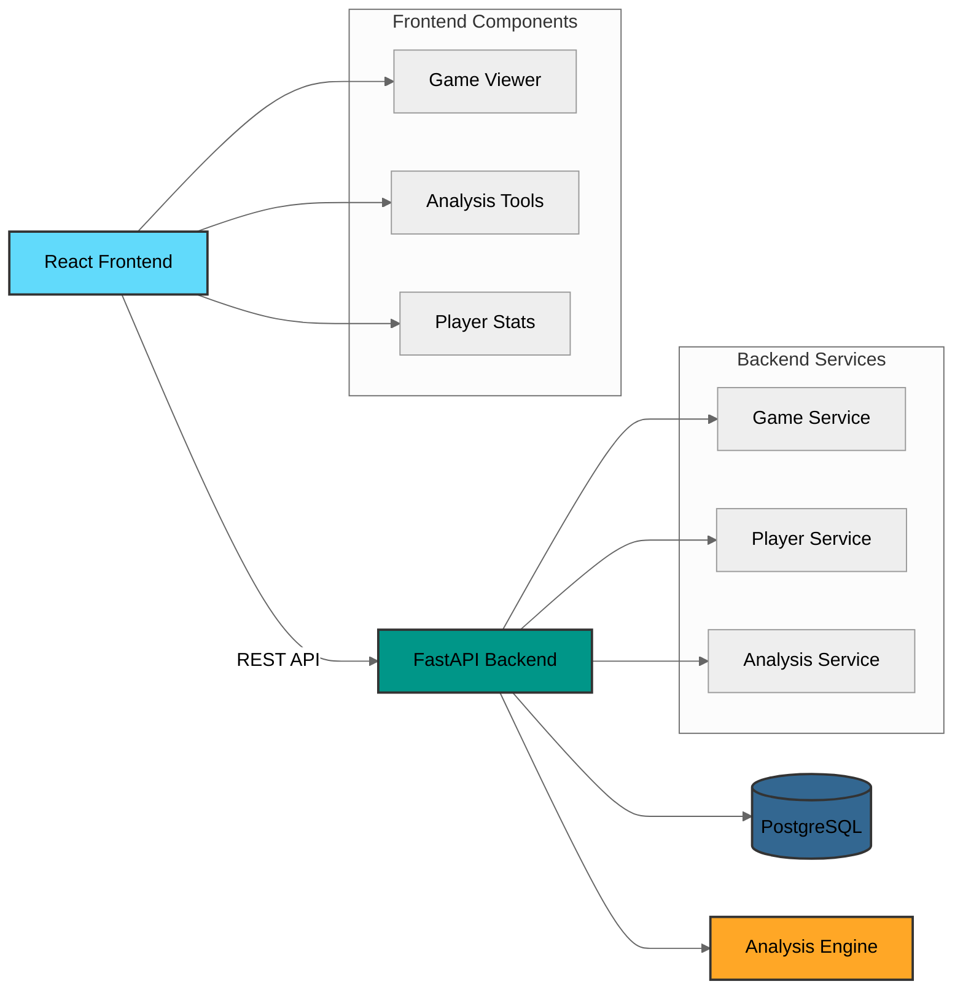

# Chess Database Documentation

The Chess Database is a powerful system for analyzing chess games and tracking player statistics. This documentation will help you understand, use, and contribute to the project.

{: .fs-6 .fw-300 }

[Get Started](setup-guide.md){: .btn .btn-primary .fs-5 .mb-4 .mb-md-0 .mr-2 }
[View on GitHub](https://github.com/nessaee/chess-database){: .btn .fs-5 .mb-4 .mb-md-0 }

---

## Quick Start

1. [Setup your environment](setup-guide.md)
2. [Learn the architecture](architecture.md)
3. [Explore the API](api-reference.md)
4. [Start developing](development-guide.md)

## System Overview

The Chess Database is a full-stack application built with modern technologies:

## Key Features

{: .highlight }
> - **Interactive Game Analysis**: Analyze games move by move with engine evaluation
> - **Player Statistics**: Track player performance and progress over time
> - **Opening Theory**: Study and explore chess openings with statistical insights
> - **Data Import/Export**: Support for PGN import and various export formats

## Documentation Structure

{: .note }
The documentation is organized into several key sections:

### Core Concepts
- [Architecture Overview](architecture.md)
- [Data Models](models.md)
- [API Reference](api-reference.md)

### Development
- [Setup Guide](setup-guide.md): Instructions for setting up the development environment
- [Development Guide](development-guide.md): Guidelines for development
- [Deployment Guide](deployment.md)

### Components
- [Frontend Components](frontend/components.md)
- [Backend Services](backend/api.md)
- [Database Schema](backend/models.md)

## Contributing

We welcome contributions! See our [Development Guide](development-guide.md) to get started.

{: .warning }
> Please read our contribution guidelines before submitting changes.

## Support

Need help? Here's what you can do:

1. Search the documentation using the search bar above
2. Check our [GitHub Issues](https://github.com/nessaee/chess-database/issues)
3. Create a new issue with details about your problem

---

{: .note-title }
> Latest Updates
>
> Check our [GitHub repository](https://github.com/nessaee/chess-database) for the latest changes and releases.
