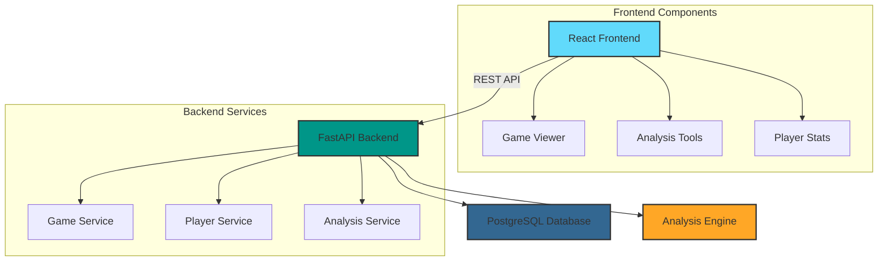

# Chess Database Documentation

The Chess Database is a powerful system for analyzing chess games and tracking player statistics. This documentation will help you understand, use, and contribute to the project.

{: .fs-6 .fw-300 }

[Get Started](guides/setup){: .btn .btn-primary .fs-5 .mb-4 .mb-md-0 .mr-2 }
[View on GitHub](https://github.com/yourusername/chess-db){: .btn .fs-5 .mb-4 .mb-md-0 }

---

## Quick Start

1. [Setup your environment](guides/setup)
2. [Learn the architecture](architecture)
3. [Explore the API](api-reference)
4. [Start developing](guides/development)

## System Overview

The Chess Database is a full-stack application built with modern technologies:

## Key Features

{: .highlight }
> - Interactive game analysis
> - Player statistics tracking
> - Opening repertoire analysis
> - Database management tools

## Documentation Structure

{: .note }
The documentation is organized into several key sections:

### Core Concepts
- [Architecture Overview](architecture)
- [Data Models](models)
- [API Reference](api-reference)

### Development
- [Setup Guide](guides/setup)
- [Development Guide](guides/development)
- [Deployment Guide](deployment)

### Components
- [Frontend Components](frontend/components)
- [Backend Services](backend/api)
- [Database Schema](backend/models)

## Contributing

We welcome contributions! See our [Development Guide](guides/development) to get started.

{: .warning }
> Please read our contribution guidelines before submitting changes.

## Support

Need help? Here's what you can do:

1. Search the documentation using the search bar above
2. Check our [GitHub Issues](https://github.com/yourusername/chess-db/issues)
3. Create a new issue with details about your problem

---

{: .note-title }
> Latest Updates
>
> Check our [GitHub repository](https://github.com/yourusername/chess-db) for the latest changes and releases.
