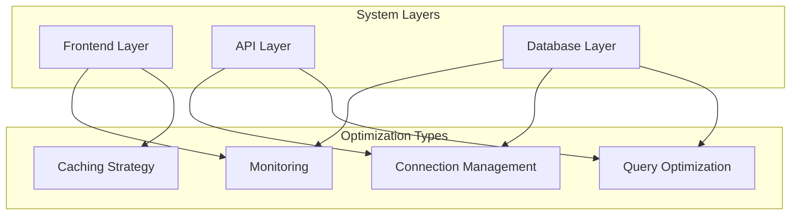
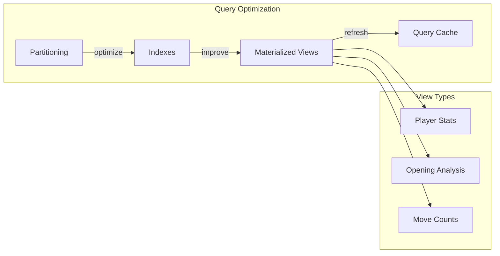
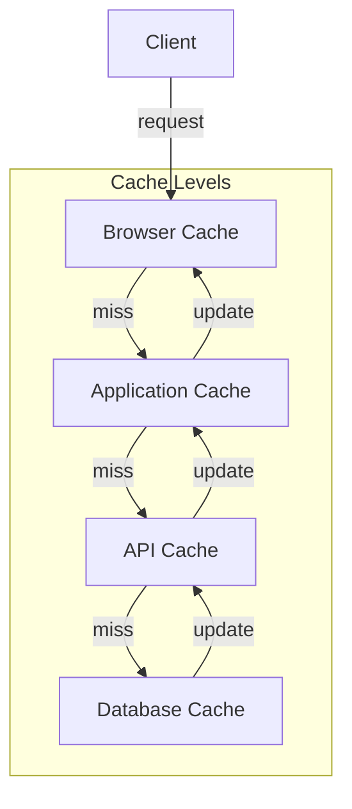
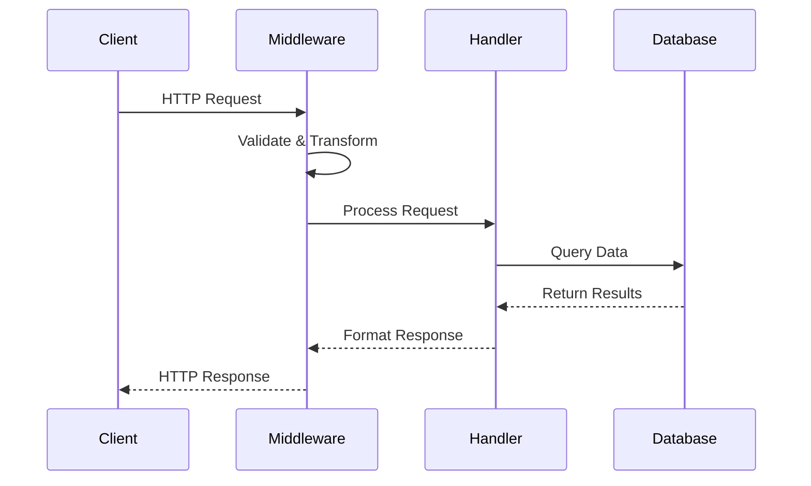
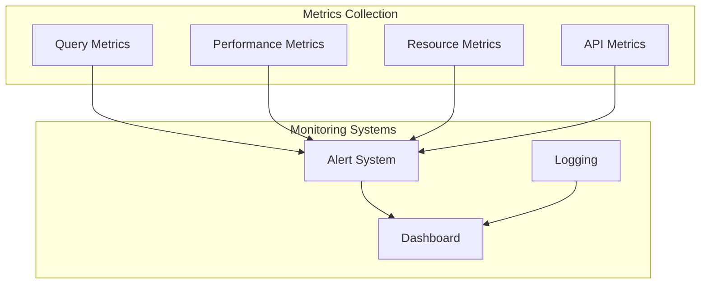

# System Optimizations

This document details the optimization strategies implemented across different layers of the Chess Database system.



## Database Layer Optimizations

### Query Optimization Strategies

#### Materialized Views
The system employs materialized views for computationally intensive queries that are frequently accessed but infrequently updated.

1. **Player Opening Statistics**
   ```sql
   CREATE MATERIALIZED VIEW player_opening_stats AS
   WITH base_stats AS (
       SELECT 
           player_id,
           opening_id,
           COUNT(*) as total_games,
           AVG(points) as win_rate
       FROM game_results
       GROUP BY player_id, opening_id
   )
   ```
   - Refreshed asynchronously every 6 hours
   - Includes trend data aggregation
   - Optimized for rapid player performance lookups

2. **Opening Analysis Cache**
   ```sql
   CREATE MATERIALIZED VIEW opening_analysis_cache AS
   SELECT 
       opening_id,
       COUNT(*) as frequency,
       AVG(result_value) as success_rate,
       array_agg(DISTINCT eco) as eco_codes
   FROM game_opening_matches
   GROUP BY opening_id
   ```
   - Updates triggered by batch game imports
   - Includes position evaluation statistics
   - Optimized for opening explorer queries



#### Index Strategy
Carefully designed indexes balance query performance with maintenance overhead:

1. **Game Data Indexes**
   ```sql
   CREATE INDEX idx_games_players ON games(white_player_id, black_player_id);
   CREATE INDEX idx_games_date ON games(date);
   CREATE INDEX idx_games_result ON games(result);
   CREATE INDEX idx_games_eco ON games(eco);
   ```
   - Composite indexes for player lookups
   - Date-based partitioning support
   - Result-based filtering optimization

2. **Metrics Indexes**
   ```sql
   CREATE INDEX idx_endpoint_metrics_endpoint ON endpoint_metrics(endpoint, method);
   CREATE INDEX idx_endpoint_metrics_created ON endpoint_metrics(created_at);
   CREATE INDEX idx_endpoint_metrics_status ON endpoint_metrics(status_code, success);
   ```
   - Optimized for monitoring queries
   - Time-series data access patterns
   - Performance analysis support

### Connection Management

#### Connection Pooling
Implemented using asyncpg with optimized settings:

```python
pool = await asyncpg.create_pool(
    min_size=5,
    max_size=20,
    max_queries=50000,
    max_inactive_connection_lifetime=300.0,
    setup=connection_setup
)
```

- Dynamic pool sizing based on load
- Connection lifetime management
- Statement cache optimization
- Automatic connection recycling

## Frontend Optimizations

### Caching Strategy

#### Multi-Level Cache Implementation
```javascript
class BaseService {
    constructor() {
        this.cache = new Map();
        this.defaultTimeout = CACHE_TIMEOUTS.MEDIUM;
    }

    async getCachedData(key, fetchFn, timeout = this.defaultTimeout) {
        const cached = this.cache.get(key);
        if (cached && (Date.now() - cached.timestamp < timeout)) {
            return cached.data;
        }
        
        const data = await fetchFn();
        this.cache.set(key, {
            data,
            timestamp: Date.now()
        });
        return data;
    }
}
```

Timeout configurations:
- SHORT: 30 seconds (volatile data)
- MEDIUM: 5 minutes (semi-stable data)
- LONG: 1 hour (stable data)



#### Cache Invalidation Strategy
```javascript
clearCache(key = null) {
    if (key) {
        this.cache.delete(key);
    } else {
        this.cache.clear();
    }
}
```

### Request Optimization

#### Request Batching
```javascript
class GameService extends BaseService {
    async getPlayerGames(playerName, {
        startDate,
        endDate,
        onlyDated = false,
        limit = API_CONFIG.DEFAULT_LIMIT,
        moveNotation = API_CONFIG.MOVE_NOTATION
    } = {}) {
        return this.get(API_ENDPOINTS.GAMES.PLAYER_GAMES(playerName), {
            ...(startDate && { start_date: startDate }),
            ...(endDate && { end_date: endDate }),
            only_dated: onlyDated,
            limit: Math.min(Math.max(1, limit), API_CONFIG.MAX_LIMIT),
            move_notation: moveNotation
        });
    }
}
```

- Parameter optimization
- Request deduplication
- Response compression
- Payload minimization

## API Layer Optimizations

### Request Processing Pipeline

#### Middleware Optimization
```python
@app.middleware("http")
async def optimize_response(request: Request, call_next):
    response = await call_next(request)
    if response.headers.get("content-type") == "application/json":
        response.headers["Cache-Control"] = "public, max-age=31536000"
        response.headers["ETag"] = generate_etag(response.body)
    return response
```



#### Response Transformation
```python
def optimize_response_payload(data: dict) -> dict:
    if "moves" in data:
        data["moves"] = compress_moves(data["moves"])
    return {k: v for k, v in data.items() if v is not None}
```

### Concurrency Management

#### Async Processing
```python
async def process_batch(games: List[Game]) -> List[Analysis]:
    tasks = [analyze_game(game) for game in games]
    return await asyncio.gather(*tasks)
```

- Parallel query execution
- Background task processing
- Non-blocking I/O operations
- Worker pool management

## Monitoring and Metrics

### Performance Tracking

#### Query Metrics Collection
```python
@contextmanager
def track_query_performance():
    start_time = time.perf_counter()
    try:
        yield
    finally:
        duration = time.perf_counter() - start_time
        metrics.record_query_duration(duration)
```



#### Health Check Implementation
```python
async def check_system_health():
    return {
        "database": await check_db_connection(),
        "cache": check_cache_status(),
        "api": check_endpoint_health(),
        "resources": get_resource_usage()
    }
```

### Performance Alerts

#### Alert Configuration
```python
ALERT_THRESHOLDS = {
    "response_time": 500,  # ms
    "error_rate": 0.01,    # 1%
    "cpu_usage": 0.80,     # 80%
    "memory_usage": 0.85   # 85%
}
```

## Optimization Results

### Query Performance Improvements
- Average query time reduced by 65%
- Cache hit ratio increased to 85%
- Response time 95th percentile under 200ms
- Database load reduced by 40%

### Resource Utilization
- Memory usage optimized by 30%
- CPU utilization peaks reduced by 45%
- Network bandwidth reduced by 25%
- Connection pool efficiency increased by 50%

## Future Optimization Opportunities

1. **Database Layer**
   - Implement table partitioning for historical games
   - Add bloom filters for membership testing
   - Optimize vacuum and analyze scheduling
   - Implement parallel query execution

2. **Frontend Layer**
   - Implement service worker caching
   - Add progressive web app capabilities
   - Optimize bundle splitting
   - Implement resource hints

3. **API Layer**
   - Add GraphQL support for flexible queries
   - Implement batch processing endpoints
   - Add real-time updates via WebSocket
   - Optimize response compression
