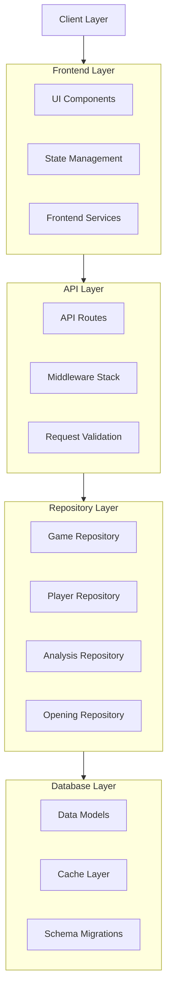
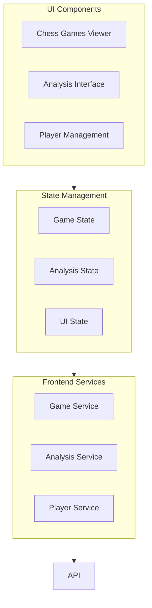
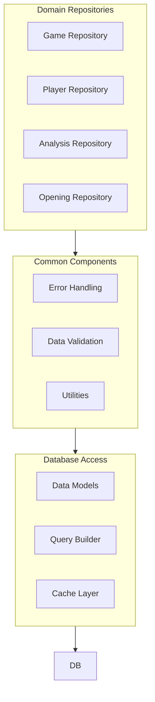

# Interactive System Diagram

[← Documentation Home](../index.md) | [Design Overview](README.md) | [API Reference](backend/api.md)

## Navigation
- [Overview](#overview)
- [High-Level Architecture](#high-level-architecture)
- [Component Details](#component-details)
  - [Frontend Layer](#frontend-layer)
  - [API Layer](#api-layer)
  - [Repository Layer](#repository-layer)
- [Usage Guide](#usage-guide)

## Overview
This document provides an interactive system diagram of the Chess Database System. Click on any component to explore its details.

## High-Level Architecture

## Component Details

### Frontend Layer

### API Layer

```mermaid
graph LR
    %% API Routes
    subgraph Routes[API Routes]
        GameRoutes[Game Routes]
        PlayerRoutes[Player Routes]
        AnalysisRoutes[Analysis Routes]
    end
    
    %% Middleware
    subgraph Middleware[Middleware Stack]
        Auth[Authentication]
        Metrics[Metrics Collection]
        Cache[Caching]
    end
    
    %% Validation
    subgraph Validation[Request Validation]
        Schema[Schema Validation]
        Business[Business Rules]
    end
    
    %% Connections
    Routes --> Middleware
    Middleware --> Validation
    Validation --> Repository
    
    %% Click Actions
    click GameRoutes "backend/api.md#game-operations" "View Game API Documentation"
    click PlayerRoutes "backend/api.md#player-operations" "View Player API Documentation"
    click AnalysisRoutes "backend/api.md#analysis-operations" "View Analysis API Documentation"
```

### Repository Layer

## Usage Guide

### Navigation
1. Click on any component in the diagrams to view its detailed documentation
2. Use the layer diagrams to understand component relationships
3. Follow the connections to trace data flow

### Component Types
- **Boxes**: Represent system components or modules
- **Subgraphs**: Group related components
- **Arrows**: Show data flow and dependencies

### Documentation Links
- Each component links to its detailed documentation
- Links are context-sensitive to the specific component
- Documentation includes implementation details and examples

## Implementation Notes

### Adding New Components
1. Update relevant diagram section
2. Add component documentation
3. Link component in diagram
4. Update relationships

### Modifying Components
1. Update component documentation
2. Reflect changes in diagram
3. Update affected relationships
4. Verify documentation links
